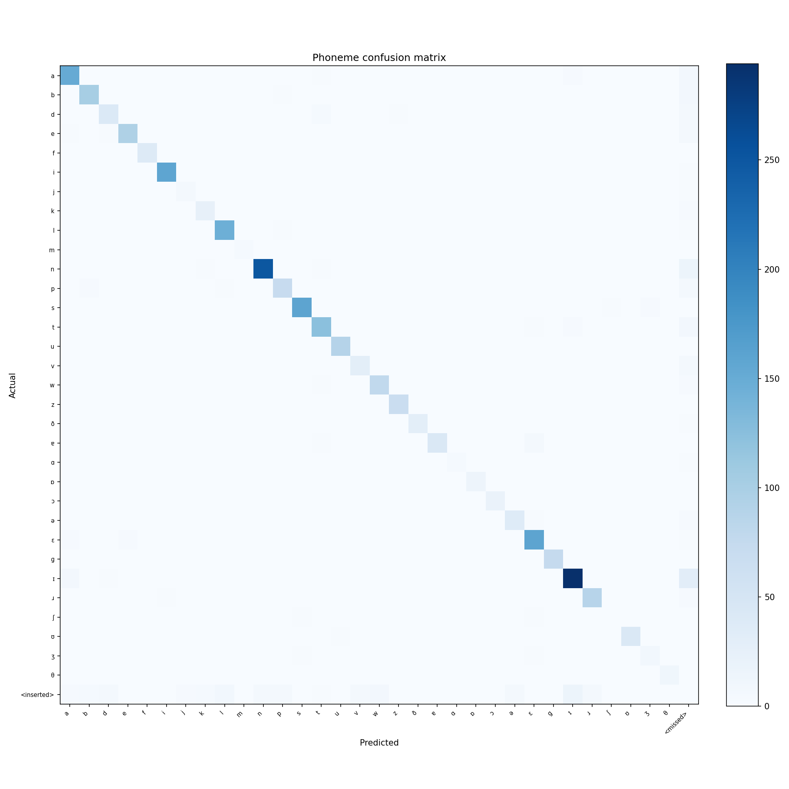
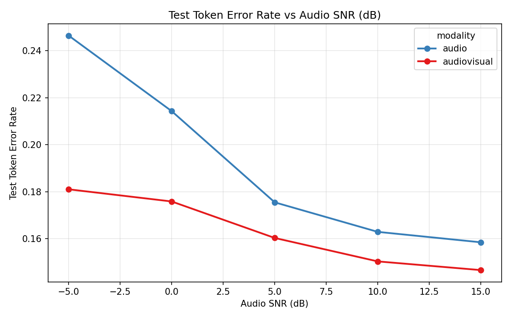
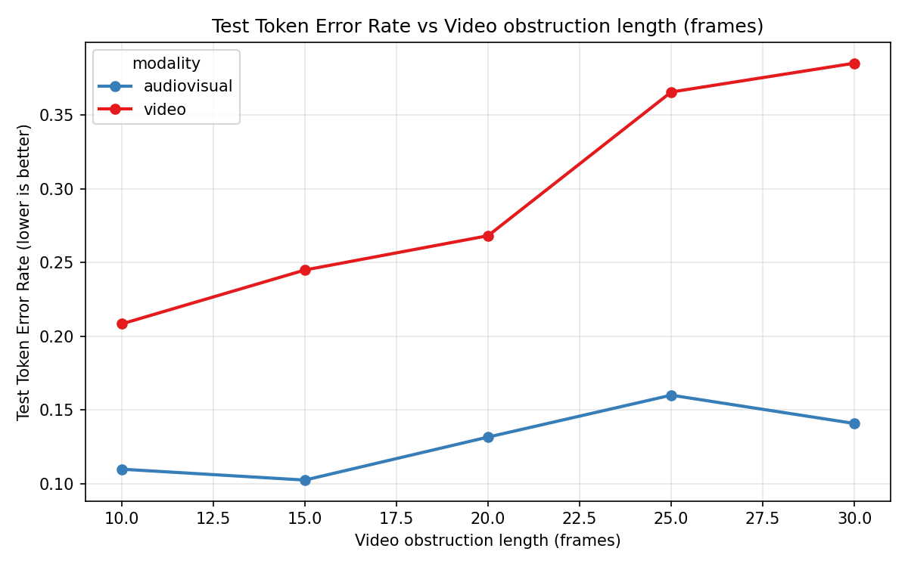
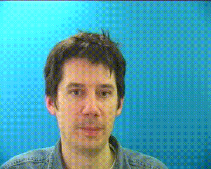

# GRID Visual Phoneme Prediction

This repository contains experiments for predicting phonemes from lip movements. The current project direction is a **GRID-based visual phoneme prediction pipeline**, with an optional audio-visual fusion model for robustness to corrupted audio and video.

Older RAVDESS, audio-reconstruction, contrastive-learning, alignment, and diffusion experiments remain in the repository for completeness and reproducibility. They are documented below, but they are not required for the final GRID phoneme-prediction workflow.

## Project pipeline

```text
GRID videos in s1/
        |
        v
crop_lips.py / save_all_lip_videos.py
        |
        v
GRID lip crops in s1_lip_crops/
        |
        v
extract_phonemes.py
        |
        v
phonemes_s1_aligned/phoneme_predictions.csv
        |
        +--> train_lip_viseme.py --> viseme_results/
        |
        +--> add_av_noise.py -> precompute_mel_spectograms.py
                                  |
                                  v
                           train_av_fusion.py --> av_fusion_results/
```

The GRID filenames encode a six-word sentence. For example, `bbaf2n` decodes to `bin blue at f 2 now`. `extract_phonemes.py` uses that filename grammar, eSpeak-NG, and wav2vec2 forced alignment to create canonical phonemes and frame-level labels at 25 FPS.

## Current evidence

The headline results below come from the constrained GRID test evaluation described in `Report/Chapters/Evaluation.tex`. The word-level decoder uses the known GRID grammar and vocabulary, so these numbers should not be interpreted as unrestricted-vocabulary lip-reading results.

| Metric | Test result | Interpretation |
| --- | ---: | --- |
| Word-correct prediction rate | **87.1%** | Individual GRID words decoded correctly. |
| Exact sentence match | **38.0%** | All six words in a GRID sentence decoded correctly. |
| Test phoneme TER | **12.41%** | Token error rate from the constrained visual model evaluation. |
| Best ablation test frame accuracy | **84.74%** | BiLSTM with full loss, before sequence collapse. |

### Qualitative and experiment figures

The confusion matrix shows the phoneme-level behavior on the test set. The TER curves show how validation performance changes as audio SNR or video obstruction severity varies.







The complete figure collection is in [`Report/figures`](Report/figures), including training curves, gate behavior, augmentation examples, and the ablation plots.

### Subtitle-generation proof of concept

The following short clip is a qualitative proof of concept: the predicted
phonemes are converted into GRID words and rendered as subtitles using the
predicted frame timings. For this example, `swwp2n` is decoded as **set white
with p 2 now**, and the predicted subtitle sequence matches the ground-truth
sequence word-for-word with matching subtitle boundaries.



[Open the original predicted-subtitle video](Report/figures/swwp2n_lipcrop_pred_subtitled.mp4) ·
[Predicted subtitles](Report/figures/swwp2n_lipcrop_pred.srt) ·
[Ground-truth subtitles](Report/figures/swwp2n_lipcrop_gt.srt)

This is an illustrative single-clip result, not an additional test metric. The
aggregate word and sentence figures above remain the appropriate quantitative
evaluation. The published proof-of-concept artifact is kept with the tracked
report figures so this preview remains available in a clean checkout.

### Ablation summary

| Variant | Test TER | Test frame accuracy | AUC validation accuracy |
| --- | ---: | ---: | ---: |
| BiLSTM + full loss | 0.1219 | 0.8474 | 0.7840 |
| Transformer + full loss | 0.1566 | 0.8394 | 0.7176 |
| No sequence encoder | 0.2464 | 0.8122 | 0.6006 |
| BiLSTM + CTC only | 0.1869 | 0.4743 | 0.6005 |
| BiLSTM + frame-CE only | 0.1419 | 0.8401 | 0.7402 |
| BiLSTM + hard targets | 0.1289 | 0.8456 | 0.7696 |

These values are also stored in [`ablation_results/ablation_summary.json`](ablation_results/ablation_summary.json) when generated locally. Generated result directories are ignored by Git in a clean checkout; the figures in `Report/figures` are the tracked presentation artifacts.

## Repository layout

### Active GRID scripts

| Script | Purpose |
| --- | --- |
| `crop_lips.py` | Detect and crop the lip region from GRID videos. |
| `save_all_lip_videos.py` | Batch wrapper for creating all GRID lip crops. |
| `extract_phonemes.py` | Generate timing-aware, frame-aligned GRID phoneme targets. |
| `train_lip_viseme.py` | Main visual phoneme model with viseme-aware loss and auxiliary CTC loss. |
| `train_av_fusion.py` | Audio-visual phoneme model with reliability-aware modality fusion. |
| `add_av_noise.py` | Create controlled audio/video corruption manifests for fusion experiments. |
| `precompute_mel_spectograms.py` | Cache mel features referenced by AV fusion manifests. |
| `ablation_experiment.py` | Compare visual model encoders and loss variants. |
| `evaluate_lip_lstm.py` | Evaluate a visual checkpoint and create duration-aligned audio examples. |
| `run_av_fusion_snr_experiment.py` | Sweep audio corruption over several SNR values. |
| `run_av_fusion_video_experiment.py` | Sweep video obstruction over several frame counts. |

### Plotting and inspection helpers

- `plot_viseme.py`
- `plot_ablation.py`
- `plot_av_fusion_sweep.py`
- `visualize_lip_viseme_augmentations.py`
- `visualize_video_augmentations.py` (older video-contrastive reference)

Generated datasets, checkpoints, manifests, and plots are kept in result directories rather than committed as source code. The thesis material is under `Report/`.

## Requirements

The active pipeline was tested on **Python 3.14.0**. The active environment is intentionally separated from the historical experiment environment:

- [`requirements-core.txt`](requirements-core.txt) contains pinned dependencies for the active GRID pipeline.
- [`requirements-dev.txt`](requirements-dev.txt) adds the test runner.
- [`requirements-legacy.txt`](requirements-legacy.txt) preserves the broad historical package-name list for RAVDESS, EnCodec, diffusion, and contrastive experiments. It is not a lockfile because the original legacy environment was not preserved.
- [`requirements.txt`](requirements.txt) is the default entry point and includes only the core requirements.

The core pins are based on the tested development environment. PyTorch CUDA wheels can be platform-specific; if the standard PyPI install is not appropriate for your GPU, install a matching PyTorch build first and then install the remaining core dependencies.

### Windows PowerShell setup

```powershell
py -3 -m venv .venv
.\.venv\Scripts\Activate.ps1
python -m pip install --upgrade pip
python -m pip install -r requirements-core.txt
```

If PowerShell blocks activation for the current terminal, run:

```powershell
Set-ExecutionPolicy -Scope Process -ExecutionPolicy RemoteSigned
.\.venv\Scripts\Activate.ps1
```

When the `python` command resolves to the Microsoft Store alias, call the environment interpreter directly:

```powershell
.\.venv\Scripts\python.exe --version
```

For tests and development checks:

```powershell
.\.venv\Scripts\python.exe -m pip install -r requirements-dev.txt
```

To run a legacy experiment, create a **separate** virtual environment and install the additional historical stack only when needed. Do not install it into the active core environment, because it re-lists overlapping packages such as PyTorch, NumPy, Transformers, and librosa without historical version pins:

```powershell
py -3.14 -m venv .venv-legacy
.\.venv-legacy\Scripts\Activate.ps1
python -m pip install -r requirements-legacy.txt
```

This legacy file records dependency names for provenance, not a guaranteed reproduction of the original runs. Exact legacy reproducibility would require the original environment export or a separately archived container.

### External tools

The active pipeline also expects:

- **FFmpeg** on `PATH` for reliable audio extraction from video containers.
- **eSpeak-NG** on `PATH` for canonical phoneme generation and evaluation audio synthesis.
- A compatible PyTorch installation. CUDA is optional but strongly recommended for model training.
- A GRID video set arranged under `s1/`. This repository does not provide a GRID downloader.

Check the PyTorch installation with:

```powershell
.\.venv\Scripts\python.exe diagnose_cuda.py
```

`crop_lips.py` downloads the MediaPipe Face Landmarker model automatically into `s1_lip_crops/models/` the first time it runs.

## Input data

Place the source GRID videos in:

```text
s1/
```

The active scripts expect the video stems to retain the standard six-character GRID naming scheme, such as `bbaf2n`. The source videos should contain the audio needed by `extract_phonemes.py`; if audio is stored separately, pass `--source-dir` to that script.

The default active directories are:

| Directory | Contents |
| --- | --- |
| `s1/` | Source GRID videos. |
| `s1_lip_crops/` | MediaPipe-generated lip-only videos. |
| `phonemes_s1_aligned/` | Phoneme CSV and alignment outputs. |
| `viseme_results/` | Visual model checkpoints, vocabularies, histories, and reports. |
| `av_noise_s1/` | One audio/video corruption manifest and generated media. |
| `av_fusion_results/` | Audio-visual model outputs. |
| `ablation_results/` | Ablation histories, metrics, and plots. |
| `snr_sweep_results/` | Audio-corruption sweep outputs. |
| `video_sweep_results/` | Video-obstruction sweep outputs. |

## Quick start: visual GRID pipeline

Run commands from the repository root. Every script supports `--help` for the complete option list.

### 1. Crop the lips

Process the GRID videos in `s1/` and write 224x224 lip crops to `s1_lip_crops/`:

```powershell
.\.venv\Scripts\python.exe crop_lips.py
```

For a small inspection run:

```powershell
.\.venv\Scripts\python.exe crop_lips.py --max-videos 3
```

The cropper also writes comparison frames to `s1_lip_crops/examples/`. To process the full folder without comparison frames, use:

```powershell
.\.venv\Scripts\python.exe save_all_lip_videos.py
```

Useful options include `--crop-margin`, `--crop-size`, and `--no-cropped-video`. Use `--crop-size 0` to preserve the detected crop size instead of resizing to a square.

### 2. Generate aligned phoneme targets

The default command uses the cropped videos as the media source and writes to `phonemes_s1_aligned/`:

```powershell
.\.venv\Scripts\python.exe extract_phonemes.py
```

The explicit form is:

```powershell
.\.venv\Scripts\python.exe extract_phonemes.py `
    --video-dir s1_lip_crops `
    --output-dir phonemes_s1_aligned `
    --fps 25
```

Before a full run, validate discovery and filename decoding with:

```powershell
.\.venv\Scripts\python.exe extract_phonemes.py --dry-run
```

The main output is:

```text
phonemes_s1_aligned/phoneme_predictions.csv
```

Important CSV fields include:

- `stem`: normalized GRID clip identifier.
- `sentence`: sentence decoded from the GRID filename.
- `canonical_phonemes`: canonical eSpeak phoneme sequence.
- `per_frame_labels`: JSON list containing one phoneme label per video frame.
- `spans_json`: timing information used for frame weighting.

The training scripts consume this CSV; they do not independently recreate the phoneme targets.

### 3. Train the visual model

The primary visual trainer is `train_lip_viseme.py`:

```powershell
.\.venv\Scripts\python.exe train_lip_viseme.py `
    --video-dir s1_lip_crops `
    --phoneme-csv phonemes_s1_aligned/phoneme_predictions.csv `
    --output-dir viseme_results
```

Default training settings include 40 epochs, a batch size of 4, 25 FPS, a BiLSTM sequence encoder, viseme-aware frame loss, and auxiliary CTC loss. For a quick smoke test, reduce the workload:

```powershell
.\.venv\Scripts\python.exe train_lip_viseme.py `
    --epochs 1 `
    --batch-size 1 `
    --num-workers 0
```

Typical outputs under `viseme_results/` include `best_model.pt`, `phoneme_vocab.json`, `history.json`, CTC outputs, reports, and plots.

### 4. Evaluate a visual checkpoint

Evaluation requires the trained checkpoint and its vocabulary file:

```powershell
.\.venv\Scripts\python.exe evaluate_lip_lstm.py `
    --checkpoint viseme_results/best_model.pt `
    --vocab-json viseme_results/phoneme_vocab.json `
    --phoneme-csv phonemes_s1_aligned/phoneme_predictions.csv `
    --video-dir s1_lip_crops `
    --output-dir eval_results `
    --num-videos 5
```

The evaluator reports sequence metrics and writes original, ground-truth, and predicted audio examples when eSpeak-NG and FFmpeg are available.

### 5. Plot visual training results

```powershell
.\.venv\Scripts\python.exe plot_viseme.py `
    --results-dir viseme_results
```

For ablation results:

```powershell
.\.venv\Scripts\python.exe plot_ablation.py `
    --results-dir ablation_results
```

To inspect the exact augmentations used by the visual dataset:

```powershell
.\.venv\Scripts\python.exe visualize_lip_viseme_augmentations.py `
    --video-dir s1_lip_crops `
    --output-dir viseme_results
```

## Audio-visual fusion pipeline

The fusion model requires the aligned phoneme CSV plus a manifest describing corrupted audio/video pairs.

### 1. Generate corrupted pairs

```powershell
.\.venv\Scripts\python.exe add_av_noise.py `
    --video-dir s1_lip_crops `
    --audio-source-dir s1 `
    --output-dir av_noise_s1 `
    --fps 25
```

The default setup applies a contiguous video obstruction and additive audio noise. The manifest records corruption spans and per-frame reliability values.

For a cheap smoke test:

```powershell
.\.venv\Scripts\python.exe add_av_noise.py --max-files 3 --dry-run
```

### 2. Cache mel features

```powershell
.\.venv\Scripts\python.exe precompute_mel_spectograms.py `
    --noise-manifest av_noise_s1/noise_manifest.csv `
    --output-dir av_noise_s1
```

The script writes `mel_cache/` and an augmented manifest. Use `--dry-run` to test one row before processing the full dataset.

### 3. Train the fusion model

```powershell
.\.venv\Scripts\python.exe train_av_fusion.py `
    --phoneme-csv phonemes_s1_aligned/phoneme_predictions.csv `
    --noise-manifest av_noise_s1/noise_manifest.csv `
    --output-dir av_fusion_results
```

The `--modality` option supports `av`, `audio`, and `video` runs. The default model uses a BiLSTM sequence encoder, reliability-gated cross-modal fusion, and auxiliary modality heads.

### 4. Run parameter sweeps

Audio SNR sweep, default values `-5, 0, 5, 10, 15` dB:

```powershell
.\.venv\Scripts\python.exe run_av_fusion_snr_experiment.py
```

Video obstruction sweep, default values `10, 15, 20, 25, 30` frames:

```powershell
.\.venv\Scripts\python.exe run_av_fusion_video_experiment.py
```

Both runners support `--phase prepare` or `--phase train`, `--modality av|audio|video`, and `--skip-existing`. Plot sweep summaries with:

```powershell
.\.venv\Scripts\python.exe plot_av_fusion_sweep.py `
    --summary-json snr_sweep_results/snr_sweep_summary.json `
    --output-dir snr_sweep_plots
```

Use `python <script> --help` to see all sweep-specific parameters.

## Ablation experiments

Run the six visual-model variants defined in `ablation_experiment.py`:

```powershell
.\.venv\Scripts\python.exe ablation_experiment.py `
    --video-dir s1_lip_crops `
    --phoneme-csv phonemes_s1_aligned/phoneme_predictions.csv `
    --output-dir ablation_results
```

The variants compare the baseline BiLSTM, Transformer and projection-only sequence encoders, CTC-only and frame-loss-only objectives, and hard targets without phoneme-similarity weighting.

## Reproducibility notes

- GRID video is treated as a 25 FPS sequence throughout the active pipeline.
- Video and phoneme targets are paired by normalized stem, not by directory order.
- The phoneme CSV is the shared contract between extraction, visual training, and AV fusion.
- Training and sweep scripts use root-relative paths and direct sibling imports. Keep these scripts at the repository root unless compatibility wrappers and subprocess paths are updated together.
- Use `--seed` where available when comparing runs.
- Use `--num-workers 0` on Windows if DataLoader worker startup causes problems.
- Cached mel files are valid only for the same FPS, sample rate, FFT, mel-bin, and hop-length settings used during training.
- The active phoneme extractor was checked with Transformers 5.2.0 and Hugging Face Hub 1.5.0: the `Wav2Vec2FeatureExtractor`, `Wav2Vec2ForCTC`, and `Wav2Vec2CTCTokenizer` APIs import successfully, and `extract_phonemes.py --help` runs under those pins. A full extraction still requires model download, eSpeak-NG, and usable GRID media.

## Generalization and evaluation scope

The reported results use the current `s1/` data path and therefore represent a speaker-specific GRID experiment, not a speaker-independent benchmark. GRID contains 34 speakers; the repository does not yet contain a completed leave-one-speaker-out or held-out-speaker result. This is an explicit limitation, not an implied claim of generalization.

The importable [`grid_phoneme`](grid_phoneme) package now centralizes active GRID paths, the 25 FPS convention, stem normalization, and speaker grouping. Its `split_by_speaker()` utility is intended as the starting point for a speaker-independent split without mixing clips from one speaker across train, validation, and test sets.

## Project hygiene

- `LICENSE`: MIT license for the source code.
- `tests/`: focused tests for shared GRID contracts and speaker grouping.
- `.github/workflows/ci.yml`: compiles the repository and runs the tests on pushes and pull requests.
- `pyproject.toml`: makes `grid_phoneme` an installable package while leaving legacy root scripts compatible.
- `CONTRIBUTING.md`: development and validation conventions.

The repository name and scripts predate the current focus. The README title deliberately describes the actual task, visual phoneme prediction, rather than talking-head video synthesis.

## Legacy and retained scripts

These scripts are kept for completeness and for reproducing earlier thesis experiments. They are not needed for the active GRID visual phoneme pipeline.

### RAVDESS data and audio experiments

- `download_kaggle_dataset.py`: downloads and inspects the Kaggle audio-visual dataset.
- `download_only_videos.py`, `download_unzip_videos.py`: older RAVDESS video acquisition helpers.
- `extract_ravdess_phonemes.py`: audio-only RAVDESS phoneme probe.
- `preprocess_ravdess_audio.py`: creates 128x50 mel chunks from RAVDESS media.
- `preprocess_mels_full.py`: creates full-length RAVDESS mel spectrograms.
- `train_ravdess_mel_cpc.py`: mel-spectrogram CPC training.
- `train_mfcc_contrastive.py`: MFCC audio contrastive learning.
- `train_time_domain_contrastive.py`: raw-waveform audio contrastive learning.
- `test_mel_reconstruction.py`, `test_mfcc_reconstruction.py`: audio reconstruction tests.

### Alignment, diffusion, and video representation experiments

- `train_audio_video_alignment.py`, `evaluate_alignment.py`: audio/video token alignment.
- `train_video_frame_order.py`: ordered-versus-shuffled video training.
- `train_video_contrastive.py`: lip-video contrastive learning.
- `train_video_conditioned_mel_diffusion.py`, `evaluate_video_conditioned_mel_diffusion.py`: video-conditioned mel diffusion.
- `train_diffusion_mel.py`: earlier conditional mel diffusion trainer.
- `train_lip_lstm.py`, `train_lip_lstm_ctc.py`, `train_lip_transformer.py`: earlier visual phoneme model variants reused by some experiments.
- `extract_durations.py`: Viterbi duration extraction for an earlier LSTM model.
- `wav_eval.py`, `wav_eval2.py`: phoneme-to-audio and GRID CTC decoding utilities.
- `visualize_video_augmentations.py`: visualization for the older video-contrastive augmentation setup.

The RAVDESS and exploratory outputs remain in their corresponding result directories, including `ravdess_mel_cpc_results/`, `aligned_results/`, `video_frame_order_results/`, `video_sweep_results/`, and related folders.

## Troubleshooting

### `python` opens the Microsoft Store

Use the repository interpreter explicitly:

```powershell
.\.venv\Scripts\python.exe <script>.py
```

### MediaPipe model or face detection errors

Ensure `mediapipe` is installed and allow `crop_lips.py` to download its Face Landmarker model. Check that the input files are readable videos and that the output directory is writable.

### Audio cannot be decoded

Install PyAV through the requirements and ensure FFmpeg is available on `PATH`. `extract_phonemes.py` and the AV scripts support audio embedded in video containers, but a valid decoder is still required.

### eSpeak-NG is missing

Install eSpeak-NG and verify that `espeak-ng` can be called from the terminal. It is required by `extract_phonemes.py` and by the audio synthesis portion of `evaluate_lip_lstm.py`.

### CUDA is unavailable

The scripts fall back to CPU where supported, but training may be slow. Run `diagnose_cuda.py` to inspect the PyTorch installation and GPU visibility.
